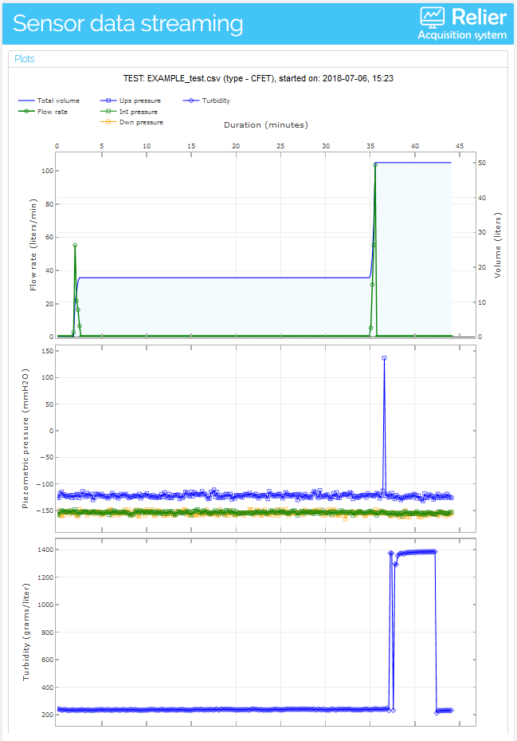

# relier-web

## Live streaming of test sensor data from [relier acquisition system](https://github.com/Ricardosgeral/relier)

This repository contains the code, files and all the instructions to deploy a web app that allows live monitoring of the 
the data sensors acquired with **relier** acquisition system. The app should have the following layout after deploy to
*https://<APP_NAME>.herokuapp.com/*  (uou can choose your <APP_NAME>).

Main features:

    App programming  : Python 3.6
    Web interface    : Interactive Python Dashboards with Plotly and Dash libraries
    Web app cloud    : Heroku (the app is deployed as a Docker container)
    Database for i/o : PostgreSQL is used as an addon provided by Heroku, to store inputs and outputs of tests      
    

## HOW TO DEPLOY the python app to the web

First of all, you need to create an account on [Heroku](https://www.heroku.com/). 
Its free, and no credit card is required.
**NOTE:** The instructions below were tested in a machine with **Ubuntu 18.04**.

### 1- Install [Heroku Cli](https://devcenter.heroku.com/articles/heroku-cli)
    
    $ sudo snap install heroku --classic

### 2 - Install [Docker](https://docs.docker.com/) (CE - Community edition)

Since Pandas and numpy libraries (that use C dependencies) are used in the app, the app needs to be deployed as a Docker container. 
For more info look [here](https://devcenter.heroku.com/articles/python-pip#scientific-python-users) and 
[here](https://devcenter.heroku.com/articles/python-c-deps).
    
    $ sudo apt-get update
    
    $ sudo apt-get install \
      apt-transport-https \
      ca-certificates \
      curl \
      software-properties-common
      
    $ sudo curl -fsSL https://download.docker.com/linux/ubuntu/gpg | sudo apt-key add -

### 3 - Create the app in Heroku (alternatively you can use the Heroku web site)

    $ sudo heroku login                                  # log in Heroku (email + password required)
    $ sudo heroku create <APP_NAME>                      # This creates the app (choose your <APP_NAME>)
    
### 4- Create a Postgres database on the Heroku app (alternatively you can use the Heroku web site)

    $ sudo heroku addons:create heroku-postgresql:hobby-dev --app <APP_NAME>   # this creates a PostgreSQL database in the app 

### 5 - Send a docker container (with code on git-hub) to the Heroku server

    $ sudo heroku login                                   # login in Heroku (email + password required)
    $ sudo heroku container:login                         # login in Heroku container (interaction with Docker)
    $ sudo git clone github.com/Ricardosgeral/relier-web  # This clones the repository in github with all code required
    $ cd relier-web                                       # go to the directory just created
    $ sudo heroku container:push web --app <APP_NAME>     # create a Docker image and push it to Heroku
    $ sudo heroku container:release web --app <APP_NAME>  # release the app in the web (know the site should be running)
 
        
## To inspect the PostgreSQL database values you can create *DataClips* in Heroku

 Open your web browser and log in at https://heroku.com
 Access https://dataclips.heroku.com
 In the top-right corner push the button "Create DataClip"
 
     - give a name to the dataclip (example: Outputs) 
     - choose the database created previously
     - write in the textbox:
        SELECT * FROM testdata ORDER BY id
     - Push the button "Create DataClip"

    This will allow you to inspect the test results values. 
    You can create another DataClip for the test Inputs, putting in the text box:
    
        SELECT * FROM testinputs
        
            
## Debug eventual errors of app after deploy

    $ sudo heroku logs --app <APP_NAME> -t
        ctr+z to leave