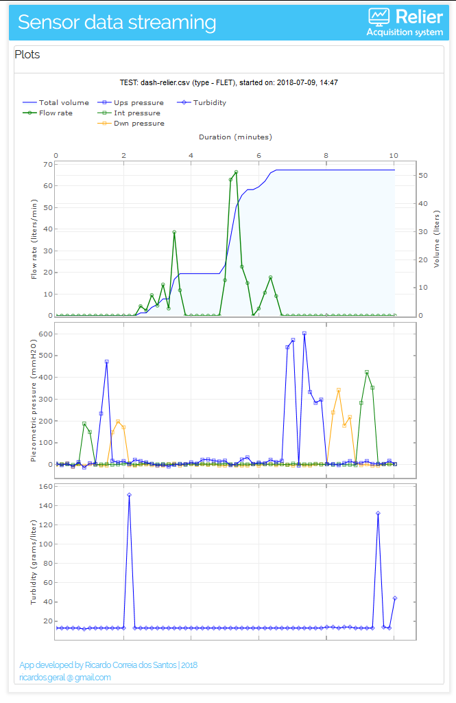

# relier-web

## Live streaming of test sensor data from [relier acquisition system](https://github.com/Ricardosgeral/relier)

This repository contains the code and all the instructions to deploy in the web a python app to live monitor 
the sensors recorded with **relier** acquisition system. This should be the look of the application which is deployed to
*https://relier-web.herokuapp.com/*

Main features:

    App code        : Python 3.6
    Web interface   : Interactive Python Dashboards with Plotly and Dash libraries
    Web app cloud   : Heroku  (the app is deployed as a Docker container)
    Database        : PostgreSQL is used as an addon provided by Heroku       
    

## HOW TO DEPLOY the python app in the web
Create an account on [Heroku](https://www.heroku.com/)

The instructions below were tested in Ubuntu 18.04 

Install [Heroku Cli](https://devcenter.heroku.com/articles/heroku-cli)
    
    $ sudo snap install heroku --classic

Install [Docker](https://docs.docker.com/) (CE) - Community edition
    
    $ sudo apt-get update
    
    $ sudo apt-get install \
      apt-transport-https \
      ca-certificates \
      curl \
      software-properties-common
      
    $ sudo curl -fsSL https://download.docker.com/linux/ubuntu/gpg | sudo apt-key add -

Create an web app in Heroku

    $ sudo heroku login
    
        Put username(email) and password of heroku account
    
    $ sudo heroku create relier-web
    
Create a Postgres database on the Heroku app

    $ sudo heroku addons:create heroku-postgresql:hobby-dev --app relier-web

Send a docker container (with code on git-hub) to the Heroku server

    $ sudo heroku login
    $ sudo heroku container:login
    $ sudo git clone github.com/Ricardosgeral/relier-web
    $ cd relier-web
    $ sudo heroku container:push web --app relier-web
    $ sudo heroku container:release web --app relier-web
    
To inspect eventual errors:

    $ sudo heroku logs --app relier-web -t
        ctr+z to leave
        
To inspect the PostgreSQL database values you can create *DataClips* in Heroku

    Open your web browser and log in at https://heroku.com
    Access https://dataclips.heroku.com
    In the top-right corner push the button "Create DataClip"
        - give a name to the dataclip (example: Outputs) 
        - choose the database created previously
        - write in the textbox:
           SELECT * FROM testdata order by id
           
        - Push the button "Create DataClip"

    This will allow you to inspect the test results values. 
    You can create another DataClip with the test Inputs, inserting in the text box 
    
        SELECT * FROM testinputs